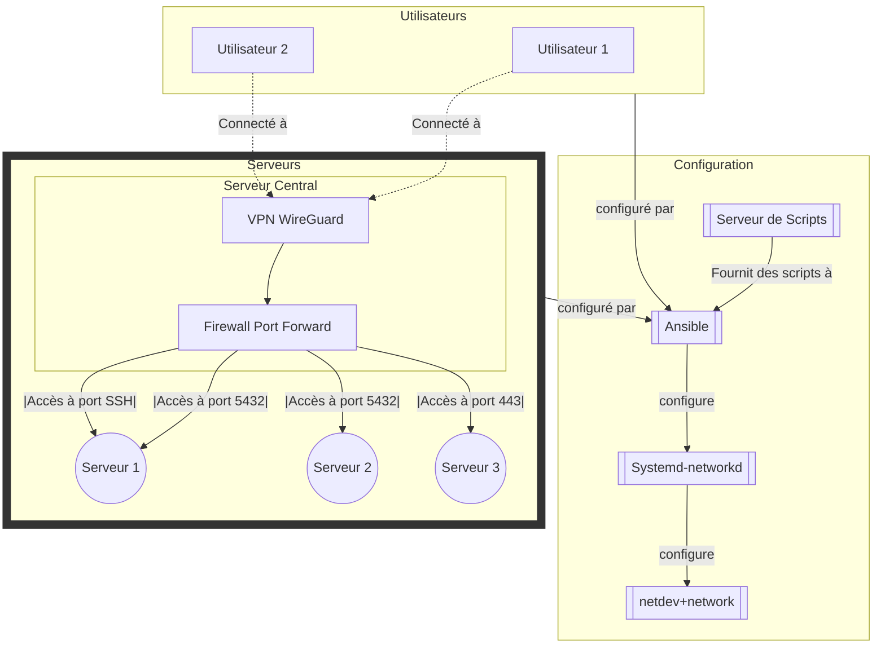

# WireGuard

# Schéma de l'infrastructure WireGuard


## Description

Ce projet contient les scripts nécessaires pour configurer et gérer un serveur WireGuard en utilisant systemd-networkd.

## Prérequis

Avant de commencer, assurez-vous d'avoir les éléments suivants :

- Un serveur Linux avec une distribution prise en charge
- Les privilèges d'administration sur le serveur
- Une connexion Internet stable

## Installation

1. Clonez ce dépôt sur votre serveur :

  ```bash
  git clone https://github.com/ArisLegend/Ansible-wireguard-systemd-network.git
  ```

2. Accédez au répertoire du projet :

  ```bash
  cd wireguard
  ```

3. Exécutez le script d'installation qui est dans playbooks/wireguard :

  ```
  ansible-playbook -i inventory.yml wireguard.yml
  ```

